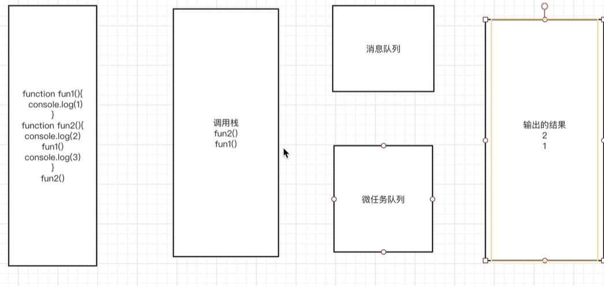

## js 语言的特点
单线程 解释性语言

## event-loop
事件循环机制 由三部分组成  
调用栈  微任务队列  消息队列

event-loop 开始的时候，会从全局一行一行的执行，遇到函数调用，会压入到调用栈中，被压入的函数被称为帧，当函数返回后会从调用栈中弹出
```js
function fun1(){
        console.log(1)
    }
    function fun2(){
        console.log(2)
        fun1()
        console.log(3)
    }
    fun2()
```
1.  

2. 

3.

4.

5.


<hr>

js中的异步操作，比如 fetch setTimeout setInterval，压入到调用栈中的时候里面的消息会进去到消息队列中去，消息队列中会等到调用栈清空之后再执行
```js
function func1(){
    console.log(1)
}
function func2(){
    setTimeout(()=>{
        console.log(2)
    }, 0)
    func1()
    console.log(3)
}
func2()
```


<hr>

promise async await 的异步操作时会加入到微任务去，会在调用栈清空的时候立即执行  
调用栈中加入的微任务会立马执行

```js
let p = new Promise(resolve => {
        console.log(4)
        resolve(5)
    })
    function func3(){
        console.log(1)
    }
    function func4(){
        setTimeout(() => {
            console.log(2)
        }, 0)
        func3()
        console.log(3)
        p.then(resolve => {
            console.log(resolve)
        })
    }
    func4()
```

1. resolve(5)执行完毕也会被弹出，但resolve会在.then的时候被输出（注意图中消息队列中没有console.log(2)，图画错了）

2. 消息队列中加入console.log(2)

**3.微任务队列会比消息队列先执行**（这个微任务队列有疑问，是不是画图顺序错误？5是否应该在图1的时候就加入了呢？）

4.
