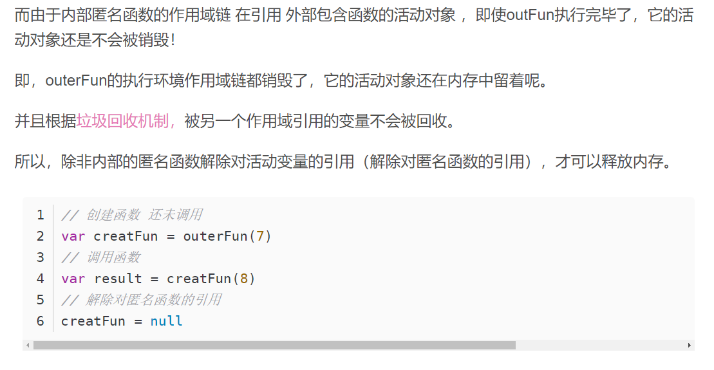

# 单例模式的理解
定义：1. 只有一个实例 2. 可以全局的访问  
主要解决：一个全局使用的类，频繁的创建和销毁  
何时使用：当你想控制实例的数目，节省系统化资源的时候  
如何实现：判断系统是否已经有这个单例，如果有则返回，没有则创建  
单例模式优点：内存中只有一个实例，减少了内存的开销，尤其是频繁的创建和销毁实例（比如说是首页页面的缓存）

使用场景：1. 全局的缓存 2. 弹窗

# es5 实现单例模式
### 需求：实现一个登陆的弹窗
1. 加载完成的时候，已经创建好这个弹窗了，一开始是隐藏的状态，然后弹窗出现
- 缺点：资源的浪费
2. 点击的时候创建
- 缺点：多次点击会重复创建
3. 单例模式
- 判断系统是否已经有这个单例，如果有则返回，没有则创建
- 有一个标记在内存中，**闭包**  
参考文章：[闭包为什么会造成内存泄漏？](https://blog.csdn.net/kk211814/article/details/88323872)

      

# es6 实现单例模式
- es6 之前 js 是无类的语言
- class 类可以看做是 es5 构造函数的语法糖

