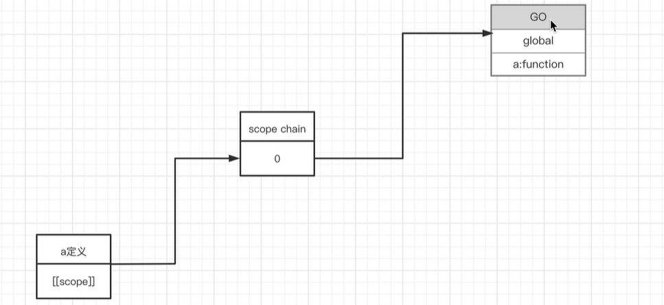
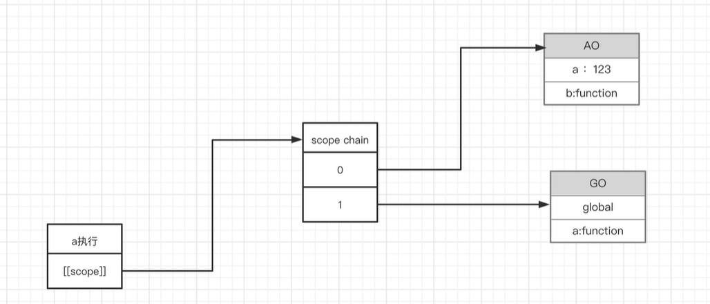
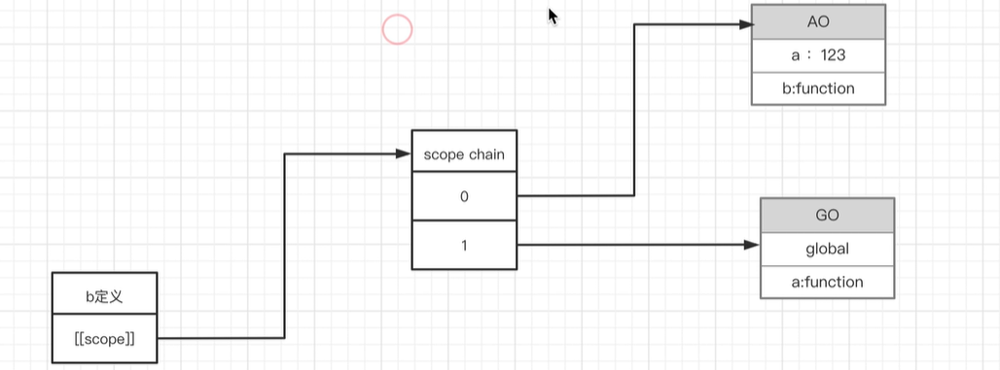
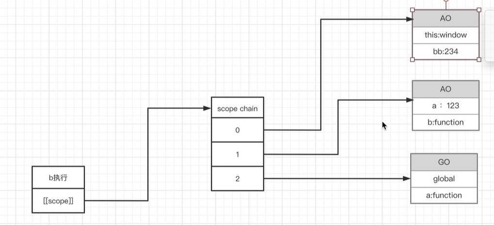
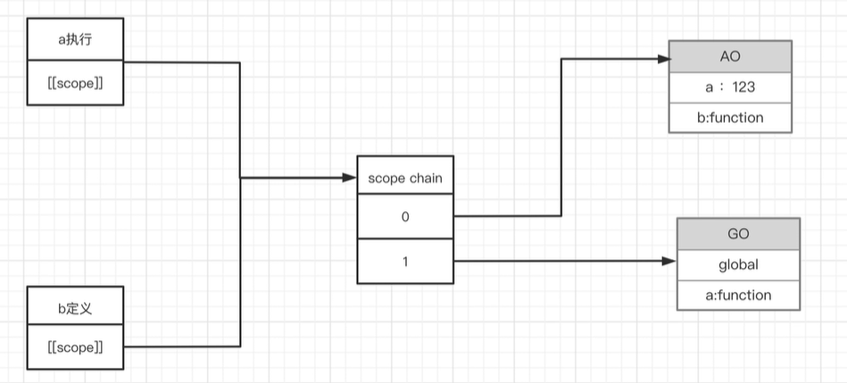

### 作用域链
会被保存到一个隐式的属性中去，[scope]这个属性是我们用户访问不到的，但是的的确确是存在的，让js引擎来访问的，里面存储的就是作用域链，是AO和GO的集合

### 作用域链过程
(预编译发生在函数执行前一刻)
1. a定义（预编译）

2. a执行

3. b定义（预编译，和a执行看到的一样）

4. b执行

### 闭包
1. a执行和b定义（预编译）的作用域链是一样的
